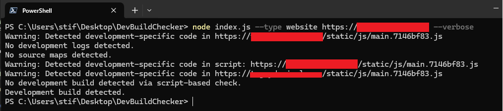
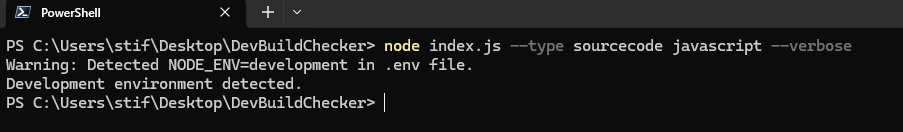

  

#  Development Build Checker

  

This script checks if a given website or source code directory is in development mode. It detects development-specific code in websites or checks the `NODE_ENV` variable in source code directories.

  

##  Usage

  

###  Website Mode

  

To check if a website is in development mode, use the `--type website` parameter followed by the URL of the website.

  

**Example:**

  

```sh

node  index.js  --type  website  https://example.com

```

  

To get detailed output, add the `--verbose` parameter:

  

```sh

node  index.js  --type  website  https://example.com  --verbose

```

  

###  Source Code Mode

  

To check if a source code directory is in development mode, use the `--type sourcecode` parameter followed by the path to the directory.

  

**Example:**

  

```sh

node  index.js  --type  sourcecode  /path/to/source/code

```

  

To get detailed output, add the `--verbose` parameter:

  

```sh

node  index.js  --type  sourcecode  /path/to/source/code  --verbose

```

  

##  Output

  

The script will output whether a development build is detected or not. In verbose mode, it will provide additional details about the checks performed.

  

##  Requirements

  

- Node.js

- Puppeteer

- File system module

  

##  Installation

  

1. Clone the repository.

2. Navigate to the project directory.

3. Install the necessary dependencies using npm:

  

```sh

npm  install  puppeteer

```

  


## Contact

For any inquiries or further information, you can reach out to me through:

- [LinkedIn](https://www.linkedin.com/in/huseyintintas/)
- [Twitter](https://twitter.com/1337stif)